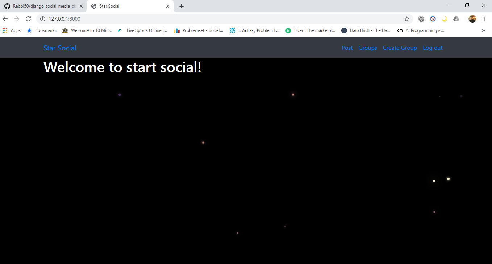
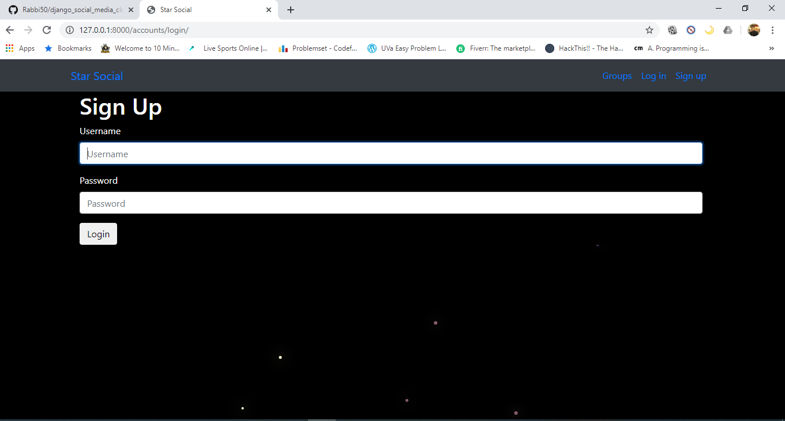
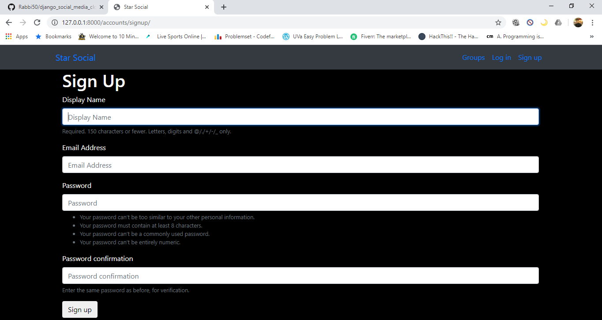
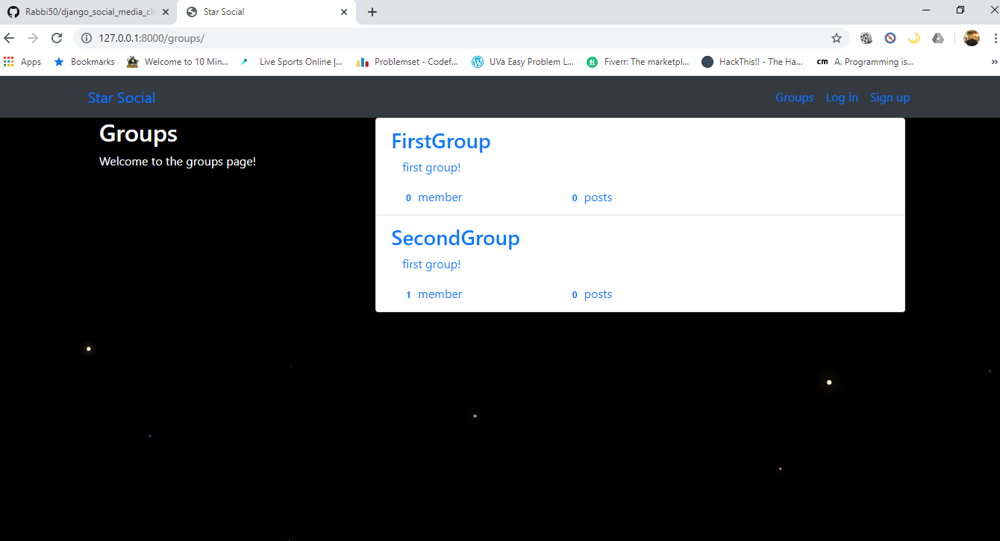
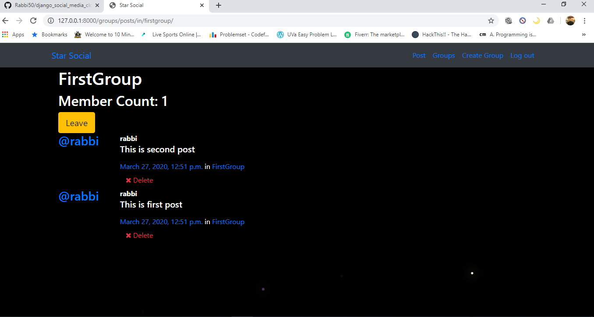

# django_social_media_clone

It is a simple social site project which made by using Django.This is a nice example for django project who wants to practice django by self.Here use class based django views.Also  this projectis example of django class based views.

# Features
* Login and signup
* Create post and Group
* Post in group
* Join and leave group
* Delete post and group

# Usage
* Pyhton 
* Django
* Class based views
* Some js animation using canvas

# Project Images

## Home View

## SignIn View

## SignUp View

## GroupList View

## PostList View

